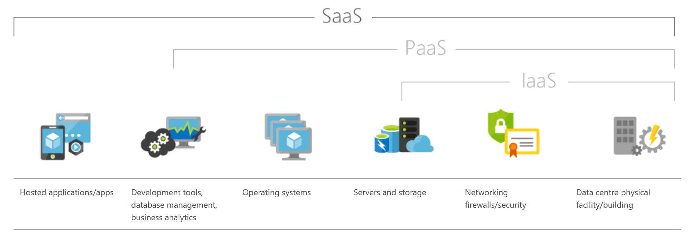

# DevOps

## Why DevOps - Benefits to business

DevOps has a positive impact including technical, business and cultural 

There are technical benefits:
- Continuous software delivery
- Less complexity to manage
- Faster resolution of problems
There are cultural benefits:
- Happier, more productive teams
- Higher employee engagement
- Greater professional development opportunities
And there are business benefits:
- Faster delivery of features
- More stable operating environments
- Improved communication and collaboration
- More time to innovate (rather than fix/maintain)

## Tools of DevOps
- Slack
- Jenkins
- Docker
- Phantom
- Naigos
- Vagrant
- Ansible
- GitHub
- Sentry
- BitBucket

## Cloud Computing

## What is SAAS, PAAS, IAAS and when should we use them?

### SAAS
Software as a service (SaaS) is a cloud based service where you access an application through the internet rather than downloading software to your PC

Advantages 
	- Accessibility
	- Compatibility with other operating systems and hardware
	- Operational management
	- Lower upfront costs
	- Updates can happen centrally instead of locally

Disadvantages
	- Requires internet connection

### PAAS
Platform as a service (PaaS) is a development and deployment environment in the cloud which enables delivery of applications no matter how sophisticated and operates on a pay as you go basis.

Advantages
- Reduces coding time
- Development capabilities without extra staff
- Can develop on multiple platforms
- Affordable

Disadvantages

### IAAS
Infrastructure as a service (IaaS) is a computing infrastructure which is provisioned over the internet

Advantages
	- Eliminates capital expense and reduces ongoing cost. IaaS sidesteps the upfront expense of setting up and managing an on-site data centre, making it an economical option for start-ups and businesses testing new ideas.
	- Improves business continuity and disaster recovery. Achieving high availability, business continuity and disaster recovery is expensive, as it requires a significant amount of technology and staff. But with the right service level agreement (SLA) in place, IaaS can reduce this cost, meaning you can access applications and data as usual during a disaster or outage.
	- Innovate rapidly. As soon as you’ve decided to launch a new product or initiative, the necessary computing infrastructure can be ready in minutes or hours, rather than the days or weeks (and sometimes months) it could take to set up internally.
	- Respond more quickly to shifting business conditions. IaaS enables you to quickly scale up resources to accommodate spikes in demand for your application – during the holidays, for example – then scale resources back down again when activity decreases to save money.
	- Focus on your core business. IaaS frees up your team to focus on your organisation’s core business rather than on IT infrastructure.
	- Increase stability, reliability and supportability. With IaaS, there’s no need to maintain and upgrade software and hardware or troubleshoot equipment problems. With the appropriate agreement in place, the service provider ensures that your infrastructure is reliable and meets SLAs.
	- Better security. With the appropriate service agreement, a cloud service provider can provide security for your applications and data that may be better than what you can attain in-house.
	- Gets new apps to users faster. Because you don’t need to first set up the infrastructure before you can develop and deliver apps, you can get them to users faster with IaaS.

Source (https://azure.microsoft.com/en-gb/overview/what-is-iaas/)

### What do we mean by on prem / localhost?
	- On-premises (sometimes abbreviated as "on-prem") uses local resources to place software which runs on premises (in the building)
	- Localhost is the default name describing the local computer address

